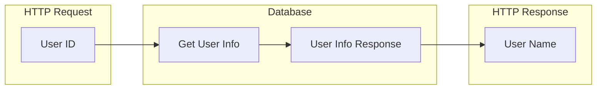
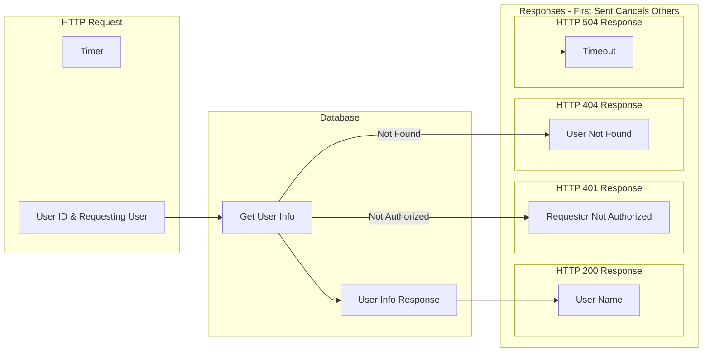

# Quantum Nest

Substantially all of development is a series of message management
and set/state management operations, both persistent and local/non-persistent
state.

> Huh What?!? Programming is so much more!!!

Turns out it's not.

An `HTTPS` request is just a message that has as part of its semantics
an `HTTPS` response message.

Authorization is simply message management (filtering).

Sometimes, a single message will "fan out" into a series of
messages, some of which have implied responses (a Remote
Procedure Call, RPC).

Every single `async` function in JavaScript or Rust is
simply an asynchronous message, and sometimes the response
to that message is required.

So much of how we do computing today is bridging between
the messages with schemas style description (e.g.,
[OpenAPI/Swagger](https://swagger.io/specification/)) and
associated bridges to imperative programming (code generators)
or storages schema management and bridges to imperative
languages (e.g., migration files and object/relational mappers).

However, much of imperative coding is taking inputs from HTTP
requests and other messages, formatting responses from one set
of "calls" (remember, `async` calls are simply messages wrapped in
imperative code) into a response to the current call.

## Being Explicit

What if we had a way to be explicit about the fields in
each message and mapping responses into fields in the response message?

For example, if an HTTP request comes in with a `user id` and the response
calls for the `user name`, the message flow is simple:

* The `User ID` field is extracted from the HTTP request and a `Get User Info`
  message is sent to the Database.
* The Database formats a `User Info Response` message and sends it back to
  the http message handler.
* The http message handler extracts to `User Name` field from the response and
  formats an HTTP Response message that contains `User Name`



So far, this doesn't seem like it's a win to do things a new way... but the "happy path"
is rarely the only path. Let's model a more normal situation with `401` `404` and `5xx` cases.



With 4 different cases. the code becomes more complex. The code
has to set a timer and if the answer does not come back from the
database in time, a `504` gets returned (sent as a reply message).

In the case of the response from `Database`, the appropriate HTTP
Response Message is crafted.

So, where is there savings?

Composability.

In imperative code, it's difficult to compose a function/method to
deal with the various cases. However, when the pieces are declarative,
it's possible to declare additional handlers, cases, that are included
by reference.

In pseudo-code:

```java
http_response := first_of(user_name_handler, failure_handlers, timeout_handlers)
```

But that's still kinda clumsy because each handler has to know about failure handlers and timeout handers.
It'd be much better if the other handlers were implicit or specified by [midware](https://www.moesif.com/blog/engineering/middleware/What-Is-HTTP-Middleware/).

What we really want is to apply a particular behavior to all transformations from "Database Response" to "HTTP Response" that are unhandled. Once again, pseudo-code:

```Scala
when database_response -> http_response && database_response.type == NOT_FOUND => 
   http_response {
                  code: 404,
                  msg: "Not Found",
                  body: "Sorry"
                  }

```

The above code can be applied to all http response generators that do not themselves
handle the condition. This is analogous to Scala's
[Partial Function and `orElse` operator](https://stackoverflow.com/questions/55869392/composing-partialfunctions-with-orelse-when-there-is-a-wildcard-case).

> "But if I can't see what's going to happen, how can I trust things?"

Valid point. And easily addressed.

Because the system is declarative, it's possible to build a dependency graph of messages
and transforms, both explicit and implicit.

It's possible for the system to collect and present, graphically (like the above diagram),
the message handlers that will apply to any given section of the system.

Further, it is possible to perform exhaustiveness checks for every message handler
in the system. This is much like [Rust](https://doc.rust-lang.org/nightly/nightly-rustc/rustc_mir_build/thir/pattern/usefulness/index.html).

Having exhaustiveness checks ensures that the system can evolve to handle new
message types from existing services. For example, if the Database service
introduces an "over capacity" message, that would create a set of errors
around failure to handle that message. Adding something like the following:

```Scala
when database_response -> http_response && database_response.type == OVER_CAPACITY => 
   http_response {
                  code: 507,
                  msg: "Database Over Capacity",
                  body: "Sorry"
                  }

```

At a global scope will satisfy exhaustiveness checking. However, if a specific
handler dealt with `OVER_CAPACITY`, that will override the global scope.

By expressing the system as a series of messages and transforms, we get a lot of
composability as well as exhaustiveness (and reachability) testing.

What we haven't covered, yet, is the testability, distributed system characteristics,
and a spreadsheet-like dependency graph.
