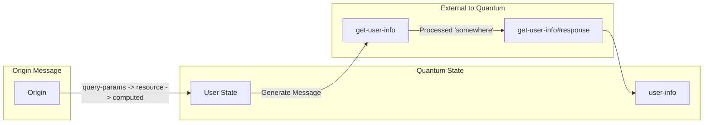

# Quantum Nest Design Thoughts

This file contains reverse chronological design thoughts.

## 2023/03/23 -- Common Semantics

### Quantum

In Quantum Nest, the "Quantum" is a discrete combination of state and compute. While "stuff" happens
inside the Quantum, the external manifestations are messages in and messages out.

When the system receives an incoming message, it associates that message with a handler. The combination
of the incoming message and associated handler creates a Quantum... the state and the compute required
to handle the message.

### Guards

A given message type (e.g., an HTTP Request message) will be handled based on matching
a "route" (a request path) along with other logic. For example:

```json
    "match-message": "HTTPRequest",
    "type": "routes",
    "routes": [
        {
            "method": "GET",
            "route": [
                ".well-known",
                "webfinger"
            ],
            "guards": {
                "query-params": [
                    {
                        "resource": [
                            {
                                "exec-and-update": "(-?> it first valid-format clojure.string/lower-case) ;; get the 'resource' parameter and set the value to the extracted value"
                            }
                        ]
                    }
                ],
                "headers": [
                    {
                        "accept": [
                            {
                                "exec": "(built-in/includes-string it `application/activity+json`)"
                            }
                        ]
                    }
                ]
            }
        }
    ],
```

The above matches `HTTPRequest` message types.

The matching/guarding is based on a "routes" set of test.

There is one route... a `GET` method to `.well-known/webfinger`.

If the URL is matched, then there are tests of both the query parameters and the headers and optionally the body for `POST`/`PUT` requests.

the `queryParams` tests the `resource` parameter. There may be multiple values of `resource` and it must be in a valid format.
The `-?>` threads `it` (borrowing from Groovy) through a series of functions and if the value
returned from any of the functions is falsy (`false` or `null`/`nil` or `Empty` or `None`),
the threading terminates. Any of the falsy values will result in the guard failing. `first` returns the first
element of the array. `valid-format` is a custom function that extracts the username from the parameter or returns a falsy
value. Finally, the resulting `String` is converted to lower case.

`exec-and-update` sets `query-params/resource/value#computed` to the resulting `String`.

The `headers` section ensures that the response will accept `application/activity+json`.

Once the guards succeed, the Quantum (unit of state and compute) is created with the `origin` message
and message passing and computation begins.

#### Quantum State Graph

The heart of Quantum Nest is the State Graph. Explicit state items are defined:

```json
    "state": {
        "user": {
            "from_message": "origin",
            "exec": "(-> it :query-params :resource :#computed)"
        },
        "user-info": {
            "from_message": "get-user-info#response",
            "exec": "(it :body)"
        },
        "timed-out": {
            "from_message": "timeout#response"
        }
    },
```

The above defines three state elements.

`user` is computed from the `origin` message. This is the incoming message that create the
Quantum. The incoming message (as enhanced by `exec-and-update` declarations in the guard)
is traversed to get the `#computed` (as compared to the `#original`) query parameter.

`user-info` is computed based on getting the `:body` of the response to the `get-user-info` message.




Thus, the `user-info` state variable will not materialize until the `get-user-info#response` message
is received.

`timed-out` is computed by the receipt of the `timeout#response` message.

### Timeouts

Time is a message. The following lines create the message:

```json
"messages": {
        "#timeout": 4000,
```

The synthetic `timeout#response` message will be received 4000ms after the message is created.

### Predicates that are only tested for existence

In some cases, the existence of a message or a change in state will trigger the sending of a message.

For example, the receipt of a `#timeout` message updates the `timed-out` state:

```json
        "timed-out": {
            "from_message": "timeout#response"
        }
```

And the resolution of the state triggers the creation and sending of the `timeout` HTTP Response:

```json
        "#response": {
            "timeout": {
                "id": "response",
                "response_code": 404,
                "response_string": "Not Found, Timeout",
                "headers": {
                    "Content-Type": "application/activity+json; charset=utf-8"
                },
                "#trigger": {"from_state": "timed-out"},
                "body": {}
            },
```

## 2023/03/20 -- Some random thoughts

Putting down the random thoughts here for further exploration.

### Data Coloring

All the data exchanged between entities (will we call these Actors or is that phrase over-used)
must be "colored" such that attributes of the data are known.

Two important attributes that we care about:

* Did the data come from the "wire"... is it from an untrusted source
* Will the data be sent "off process" where that means will the data be "executed" at the shell or sent to a database as part of a query?

If we can color data (and calls into the system), we can identify "unclean" data and ensure we clean the data
before sending it to a "risky" destination.

### "On Behalf Of"

Every message is "on behalf of" some entity. Maybe it's part of an HTTPS request
and the user was authenticated. Maybe it's a background or chron job, once again
on behalf of an entity. Every message should contain some verified artifact (e.g.,
a signed [JTW](https://jwt.io/)).

### Time

Time is an event. In all things, time is a factor. How each Message Composition will
treat time (how long to wait for data, etc.) is an interesting open quest.

### Message Propogation Tracing/Observability

Every message gets a UUID and also includes the UUID(s) of the source Messages
(or maybe a Merkel Tree of the message UUIDs??) such that message fan-out
and fan-in can be tracked.

### Computation Durability

Different messages have different durability requirements.

For example,
if a query for a low importance item (e.g., "what's the temperature in
San Francisco?") fails, there's likely very little impact.

There may be other, complex transactions (keeping in mind that distributed
transactions is a [hard problem](https://developer.ibm.com/articles/use-saga-to-solve-distributed-transaction-management-problems-in-a-microservices-architecture/)).

Thus, the durability around the coordination of a distributed transaction has a much
higher requirement (and thus a higher memory/computational cost) than other computations.

There must be a way of designating the durability of a particular message processing
activity (and we need a name for message processing activity).

## 2023/03/18 -- Message Passing

Quantum Nest is a message passing system. All of Quantum Nest
is the creation of messages, the sending of messages, and the
receiving of messages (with some wiring among the messages).

The locus of message processing is not defined. And, the locus
of processing may migrate during the processing of a collection
of messages. Thus, all "state" related to message processing
must be easily serializable.

A common pattern in programming is to invoke a method and get
a return value. For example:

```objective-c
  result = [myObject messageName:parameter] 
```

Given that Objective-C and Smalltalk were designed
as [message](https://medium.com/javascript-scene/the-forgotten-history-of-oop-88d71b9b2d9f)
[passing](https://arxiv.org/pdf/1008.1459.pdf) systems, the above code
does not require synchronous execution. Also, given that Objective-C supports [Distributed Objects](https://www.blackholeinc.com/catalog/software/Software/NeXT/PortableDistributedObjects.shtml), the locus of the execution is not defined by
the syntax of a message send.

The implementation of a message passing with response system
requires passing, either implicitly or explicitly, the destination of
a response.

For method invocations in the same address space, that's typically done with the call stack.

For a distributed system, the place to send the response must be encoded in the `Envelope`
and that place must be serializable (along with the other contents of the `Envelope`)
and the response `Channel` must be discoverable within a cluster. And a reply `Channel`
must be able to migrate across the cluster.

Thus, in order to serialize an `Envelope` and it's contents, the `Channel` must be serializable.

